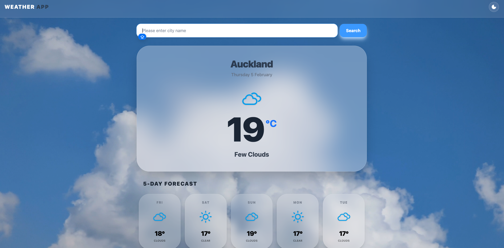
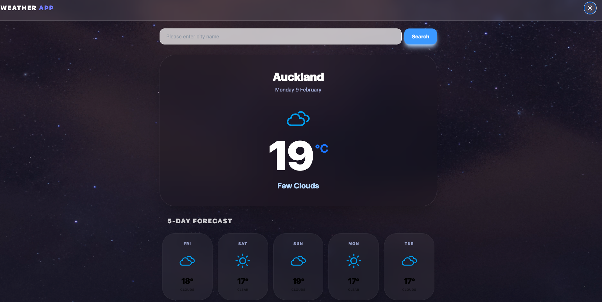

Modern Weather App
A sleek, responsive weather application built with React and Tailwind CSS. This project focuses on a "Glassmorphism" UI design and features a dynamic environment that shifts between day and night based on user preference.

Live Demo: https://weather-app-pied-psi-63.vercel.app/

Features
Dynamic Backgrounds: Smooth crossfade transitions between day and night video backgrounds.
Glassmorphism UI: High-end visual style using backdrop blurs, semi-transparent layers, and soft shadows.
Auto-Location: Automatically detects the user's current city using the Browser Geolocation API.
5-Day Forecast: Detailed upcoming weather grid with responsive layouts.
Persistent Theme: Remembers your preferred mode (Day/Night) using localStorage.

Screenshots
| ☀️ Day Mode | 🌙 Night Mode |
| :---: | :---: |
|  |  |

## 🛠️ Tech Stack
* **Frontend**: React (Vite)
* **Styling**: Tailwind CSS
* **API**: OpenWeatherMap

## ⚙️ Setup
1. `npm install`
2. Create `.env` and add `VITE_OPENWEATHER_KEY=your_key`
3. `npm run dev`